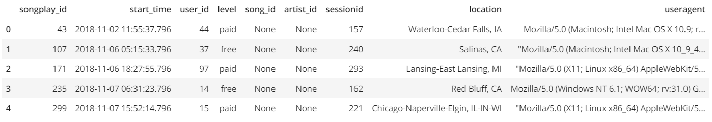
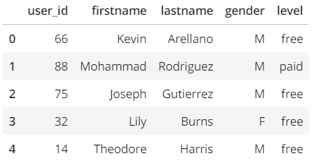
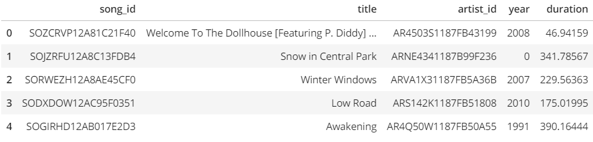
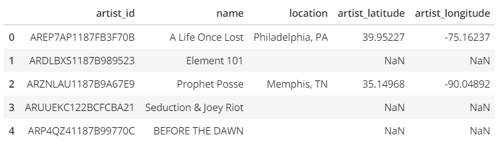
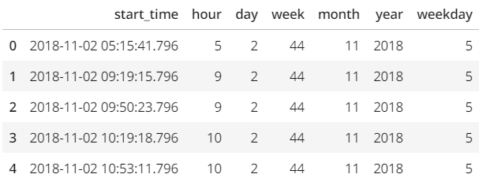
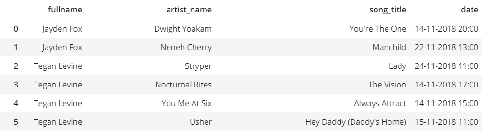

[![LinkedIn][linkedin-shield]][linkedin-url]

<!-- PROJECT LOGO -->
 

  <h3 align="center">ETL Data Warehouse on AWS Redshift</h3>

  

    Create ETL and Data warehouse on AWS.
     
     
    <a href="https://github.com/BankNatchapol/AWS-Data-Warehouse-ETL/issues">Report Bug</a>
    ·
    <a href="https://github.com/BankNatchapol/AWS-Data-Warehouse-ETL/issues">Request Feature</a>
  

<!-- TABLE OF CONTENTS -->

  
Table of Contents

  <ol>
    <li>
      <a href="#about-the-project">About The Project</a>
    </li>
    <li><a href="#dataset">Dataset</a>
        <ul>
        <li><a href="#song-dataset">Project Dataset</a></li>
        <li><a href="#song-dataset">Song Dataset</a></li>
        <li><a href="#log-dataset">Log Dataset</a></li>
      </ul>
    </li>
<li>
      <a href="#data-model">Data Model</a>
    </li>
<li>
      <a href="#getting-started">Getting Started</a>
    </li>
    <li><a href="#contact">Contact</a></li>
  </ol>

<!-- ABOUT THE PROJECT -->
## About The Project

A music streaming startup, Sparkify, has grown their user base and song database and want to move their processes and data onto the cloud. Their data resides in S3, in a directory of JSON logs on user activity on the app, as well as a directory with JSON metadata on the songs in their app.

As their data engineer, you are tasked with building an ETL pipeline that extracts their data from S3, stages them in Redshift, and transforms data into a set of dimensional tables for their analytics team to continue finding insights in what songs their users are listening to. You'll be able to test your database and ETL pipeline by running queries given to you by the analytics team from Sparkify and compare your results with their expected results.

<!-- Dataset -->
## Dataset
### Project Dataset
There are two datasets that reside in S3. Here are the S3 links for each: 
Song data:
>s3://udacity-dend/song_data

Log data:
>s3://udacity-dend/log_data

Log data json path:
>s3://udacity-dend/log_json_path.json

### Song Dataset
The first dataset is a subset of real data from the Million Song Dataset. Each file is in JSON format and contains metadata about a song and the artist of that song. The files are partitioned by the first three letters of each song's track ID. For example, here are filepaths to two files in this dataset.
>song_data/A/B/C/TRABCEI128F424C983.json 
>song_data/A/A/B/TRAABJL12903CDCF1A.json

And below is an example of what a single song file, TRAABJL12903CDCF1A.json, looks like.

>{"num_songs": 1, "artist_id": "ARJIE2Y1187B994AB7", "artist_latitude": null, "artist_longitude": null, "artist_location": "", "artist_name": "Line Renaud", "song_id": "SOUPIRU12A6D4FA1E1", "title": "Der Kleine Dompfaff", "duration": 152.92036, "year": 0}

### Log Dataset

The second dataset consists of log files in JSON format generated by this event simulator based on the songs in the dataset above. These simulate activity logs from a music streaming app based on specified configurations.

The log files in the dataset you'll be working with are partitioned by year and month. For example, here are filepaths to two files in this dataset.
>log_data/2018/11/2018-11-12-events.json  
>log_data/2018/11/2018-11-13-events.json

And below is an example of what the data in a log file, 2018-11-12-events.json, looks like.

<!-- DATA MODEL -->
## Data Model
This is my database Star Schema.

<!-- GETTING STARTED -->
## Getting Started

### Installation
install package with
> pip install -r requirements.txt
### Config files
create config files for access AWS 
infra.cfg : 
> [AWS] 
> KEY = ?   &emsp;&emsp;&emsp;&emsp;&emsp;&emsp;&emsp;&emsp;&emsp;&emsp;&emsp;&emsp;&emsp;&emsp;&nbsp; //  AWS IAM User Key 
> SECRET = ?   &emsp;&emsp;&emsp;&emsp;&emsp;&emsp;&emsp;&emsp;&emsp;&emsp;&emsp;&emsp;&nbsp;&nbsp; // AWS IAM User Secret 
>
> [DWH] 
> DWH_CLUSTER_TYPE =multi-node 
> DWH_NUM_NODES =4  
> DWH_NODE_TYPE=dc2.large 
>
> DWH_IAM_ROLE_NAME = ? &emsp;&emsp;&emsp;&emsp;&emsp;&nbsp; // Define IAM Role Name 
> DWH_CLUSTER_IDENTIFIER = ? &emsp;&emsp;&emsp;&nbsp;&nbsp;&nbsp; // Define Cluster Name 
> DWH_DB = ? &nbsp;&nbsp;&nbsp;&nbsp;&emsp;&emsp;&emsp;&emsp;&emsp;&emsp;&emsp;&emsp;&emsp;&emsp;&nbsp;&nbsp; // Define DB Name 
> DWH_DB_USER = ? &nbsp;&nbsp;&nbsp;&nbsp;&nbsp;&emsp;&emsp;&emsp;&emsp;&emsp;&emsp;&emsp;&nbsp;&nbsp; // Define DB Username 
> DWH_DB_PASSWORD = ? &emsp;&emsp;&emsp;&emsp;&emsp;&emsp;&nbsp;// Define DB Password 
> DWH_PORT = 5439

dwh.cfg : 
> [CLUSTER] 
> HOST = 
> DB_NAME = 
> DB_USER = 
> DB_PASSWORD = 
> DB_PORT = 
>
> [IAM_ROLE] 
> ARN = 
> 
> [S3] 
> LOG_DATA = ? &emsp;&emsp;&emsp;&emsp;&emsp;&emsp;&emsp;&emsp;&emsp;&emsp;&emsp;&nbsp;&nbsp; // Define event logs data path to S3  
> LOG_JSONPATH = ? &emsp;&emsp;&emsp;&emsp;&emsp;&emsp;&emsp;&emsp;&emsp;&nbsp; // Define event logs json path data path to S3  
> SONG_DATA = ? &emsp;&emsp;&emsp;&emsp;&emsp;&emsp;&emsp;&emsp;&emsp;&emsp;&nbsp;&nbsp;&nbsp; // Define songs data path to S3

### Create all AWS infrastructures
> python create_infras.py

### Create Tables in AWS Redshift
> python create_tables.py

### ETL Processes
> python etl.py

### Test queries
run script in test_queries.ipynb
- SELECT * FROM songplays LIMIT 5; 
  
- SELECT * FROM users LIMIT 5; 
  
- SELECT * FROM songs LIMIT 5; 
  
- SELECT * FROM artists LIMIT 5; 
  
- SELECT * FROM times LIMIT 5; 
  
- SELECT u.firstName + ' ' + u.lastName as fullName,  
  &emsp;&emsp;&emsp;&nbsp;&nbsp;a.name as artist_name,  
  &emsp;&emsp;&emsp;&nbsp;&nbsp;s.title as song_title,  
  &emsp;&emsp;&emsp;&nbsp;&nbsp;t.day::VARCHAR + '-' + t.month::VARCHAR + '-' + t.year::VARCHAR + '  ' + t.hour::VARCHAR + ':00' as date  
  &emsp;&emsp;&emsp;&nbsp;&nbsp;FROM songplays sp 
  &emsp;&emsp;&emsp;&nbsp;&nbsp;JOIN users u on sp.user_id = u.user_id 
  &emsp;&emsp;&emsp;&nbsp;&nbsp;JOIN artists a on sp.artist_id = a.artist_id 
  &emsp;&emsp;&emsp;&nbsp;&nbsp;JOIN songs s on sp.song_id = s.song_id 
  &emsp;&emsp;&emsp;&nbsp;&nbsp;JOIN times t on sp.start_time = t.start_time 
  

<!-- CONTACT -->
## Contact

Facebook - [@Natchapol Patamawisut](https://www.facebook.com/natchapol.patamawisut/)

Project Link: [https://github.com/BankNatchapol/AWS-Data-Warehouse-ETL](https://github.com/BankNatchapol/AWS-Data-Warehouse-ETL)

<!-- MARKDOWN LINKS & IMAGES -->
<!-- https://www.markdownguide.org/basic-syntax/#reference-style-links -->
[linkedin-shield]: https://img.shields.io/badge/-LinkedIn-black.svg?style=for-the-badge&logo=linkedin&colorB=555
[linkedin-url]: https://www.linkedin.com/in/natchapol-patamawisut
